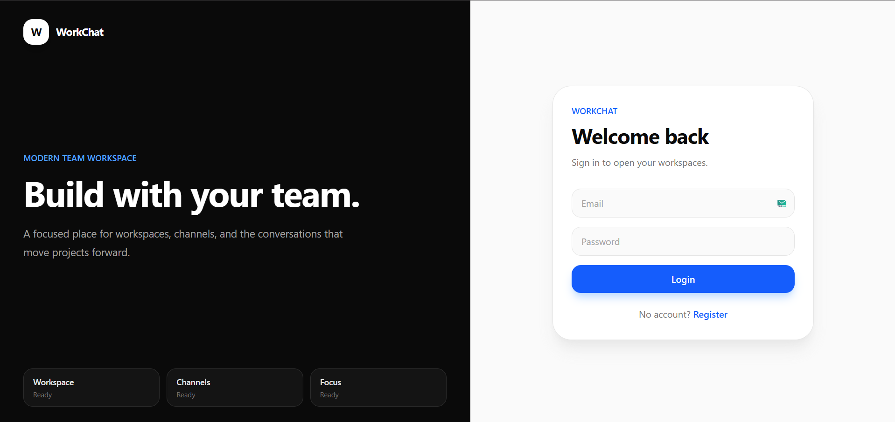
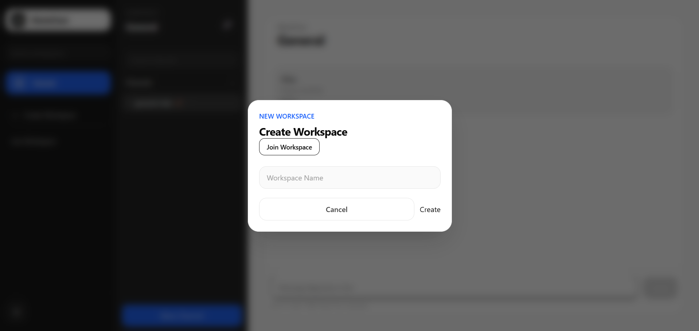
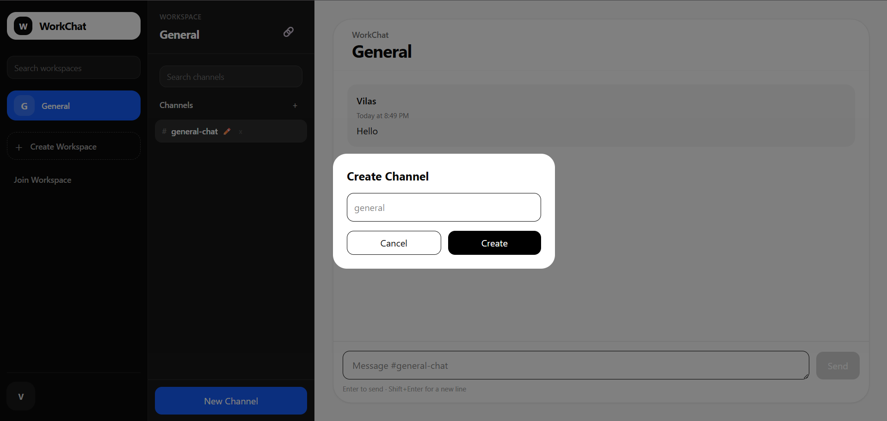
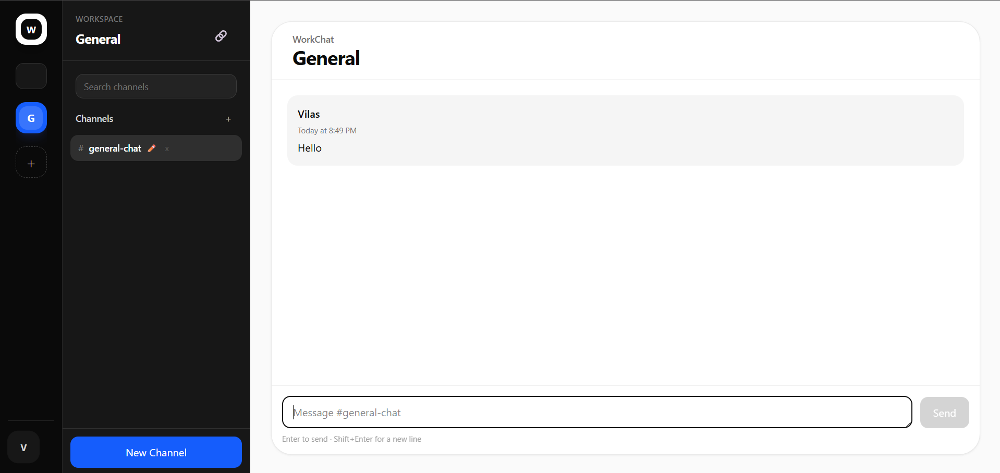

# WorkChat

A modern real-time team collaboration platform inspired by Slack and Discord.

WorkChat enables teams to create workspaces, organize discussions into channels, and communicate instantly through real-time messaging.

---

## Features

### Authentication

* User Signup & Login
* JWT Authentication
* Protected Routes
* User Profiles

### Workspaces

* Create Workspaces
* Join Workspaces via Invite Codes
* Workspace Management
* Workspace Search

### Channels

* Create Channels
* Rename Channels
* Delete Channels
* Channel Search

### Messaging

* Real-Time Messaging (Supabase Realtime)
* Edit Messages
* Delete Messages
* Copy Messages
* Message Timestamps
* Auto Scroll to Latest Messages
* Hover Message Actions

### User Experience

* Responsive Design
* Modern Dark UI
* Smooth Animations
* Enter to Send
* Shift + Enter for New Lines

---

## Tech Stack

### Frontend

* React
* Vite
* Tailwind CSS
* Axios
* React Icons

### Backend

* Node.js
* Express.js
* JWT Authentication

### Database & Realtime

* Supabase
* PostgreSQL
* Supabase Realtime

---

## Architecture

```text
Client (React)
       │
       ▼
Express API
       │
       ▼
Supabase PostgreSQL
       │
       ▼
Realtime Messaging
```

## Key Highlights

* Real-time communication using Supabase Realtime
* Workspace and channel based collaboration
* Secure authentication and authorization
* Modern scalable architecture
* Clean and responsive user experience

---

## Future Improvements

* Direct Messages (DMs)
* Online Presence Indicators
* Typing Indicators
* Avatar Uploads
* File Sharing
* Notifications
* Message Reactions
* Workspace Roles & Permissions

---

## Local Setup

### Clone Repository

```bash
git clone <repo-url>
cd workchat
```

### Install Dependencies

Frontend

```bash
cd client
npm install
npm run dev
```

Backend

```bash
cd server
npm install
npm run dev
```

### Environment Variables

Create a `.env` file in client and server folder and add:

# Client
```
VITE_SUPABASE_URL=
VITE_SUPABASE_ANON_KEY=
VITE_API_URL=
```

# Server
```
SUPABASE_URL=
SUPABASE_SERVICE_ROLE_KEY=
JWT_SECRET=
```

---

## Screenshots

| Authentication | Workspace Management |
|----------------|----------------------|
|  |  |

| Channel Management | Chat Screen |
|--------------------|-------------|
|  |  |

---

## Folder Structure
```
WorkChat
│
├── client
│   ├── components
│   ├── pages
│   └── services
│
├── server
│   ├── routes
│   ├── controllers
│   └── config
│
└── README.md
```

## Learning Outcomes
```
This project strengthened my understanding of authentication, REST API design, real-time communication, PostgreSQL, state management, and building scalable full-stack applications.
```

## License

MIT License
